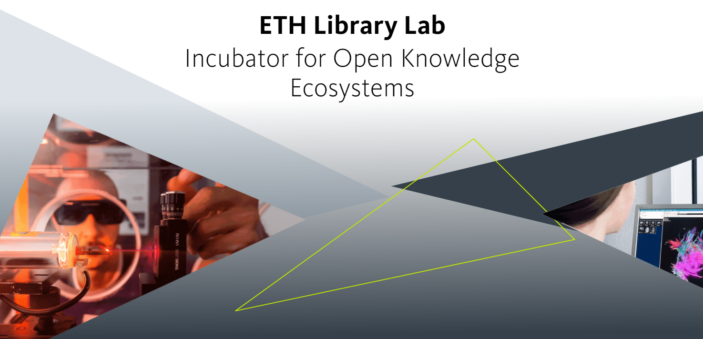
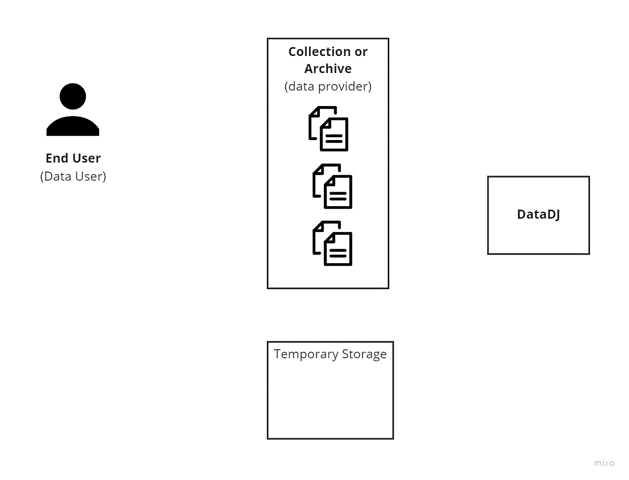

<!-- #  -->

## Hi there 👋

### thanks for stopping by my Repo

I love using technology to solve problems and improve processes. Whether backend, ML, data processing or Frontend, I'm eager to dive into whatever's needed to get a project going.  

Luckily I get to work on lots of open source projects.  
You can check out projects that I've contributed to on the github page of 

[ETH Library Lab](https://github.com/eth-library-lab/eth-library-lab)

- 🔭 I’m currently working on backend microservices and full stack image retrieval applications at ETH Library Lab
- 🌱 Lately I've been loving writing code in [Go](https://go.dev/) and keeping my notes in [obsidian](https://obsidian.md/)
- 💬 Ask me about: how the irish rugby team is doing... then how we could start designing and hacking your latest idea for an application  
- 📫 How to reach me: [linkedin.com/in/barry-sunderland/](https://www.linkedin.com/in/barry-sunderland/)

## Projects at ETH Library Lab: 

### [open imageSearch](https://imagesearch.ellprototypes.ch/)  
image retrieval application to help art collections find image metadata  
<i>tech:</i> python, Django, Tensorflow, Postgresql, Vue  
 

### Data DJ  
File access microservice to support Data Science researchers  
<i>tech:</i> go, gin, mongodb, redis  
 

## Blog Posts:

* First experience developing and deploying an app: https://www.librarylab.ethz.ch/tales-from-an-adventure-into-app-development/ 
* 2021 Trends in ML and data [part 1](https://www.librarylab.ethz.ch/2021-trends-in-machine-learning-and-data/) and [part 2](https://www.librarylab.ethz.ch/part-2-trends-in-machine-learning-and-data/)
* using jupyter notebooks and vuepress for writing blogposts https://barrysunderland.com/blog/using-vuepress.html

